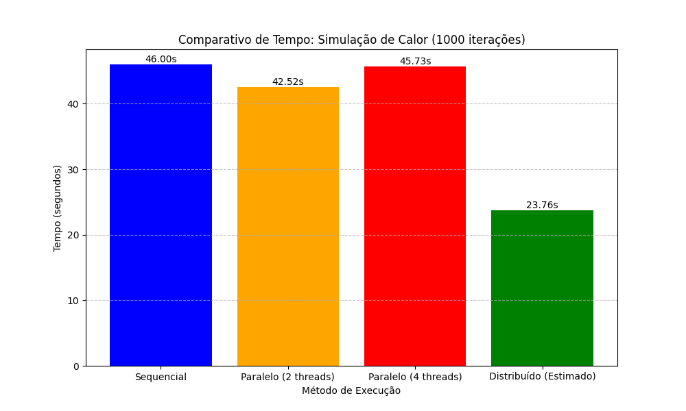

# Simulação de Difusão de Calor 🔥

Trabalho apresentado para a disciplina de Sistemas Distribuídos.
O projeto compara o desempenho de três abordagens para simular a propagação de calor em uma matriz 2D:

1.  **Sequencial**
2.  **Paralela** (Multithreading)
3.  **Distribuída** (Sockets TCP/IP)

## 📊 Resultados Obtidos

| Método | Tempo (s) | Observação |
| :--- | :--- | :--- |
| Sequencial | 46.0s | Execução base |
| Paralelo (Threads) | 42.52s | Limitado pelo GIL do Python |
| Distribuído | ~23.76s | Melhor desempenho (Processos independentes) |

## 🛠️ Tecnologias
* Python 3
* Bibliotecas: `numpy`, `threading`, `socket`, `pickle`

## ⚠️ Isenção de Responsabilidade (Disclaimer)
Este código foi desenvolvido para fins acadêmicos com apoio de ferramentas de IA para estruturação da sintaxe, conforme permitido nos requisitos do trabalho.
